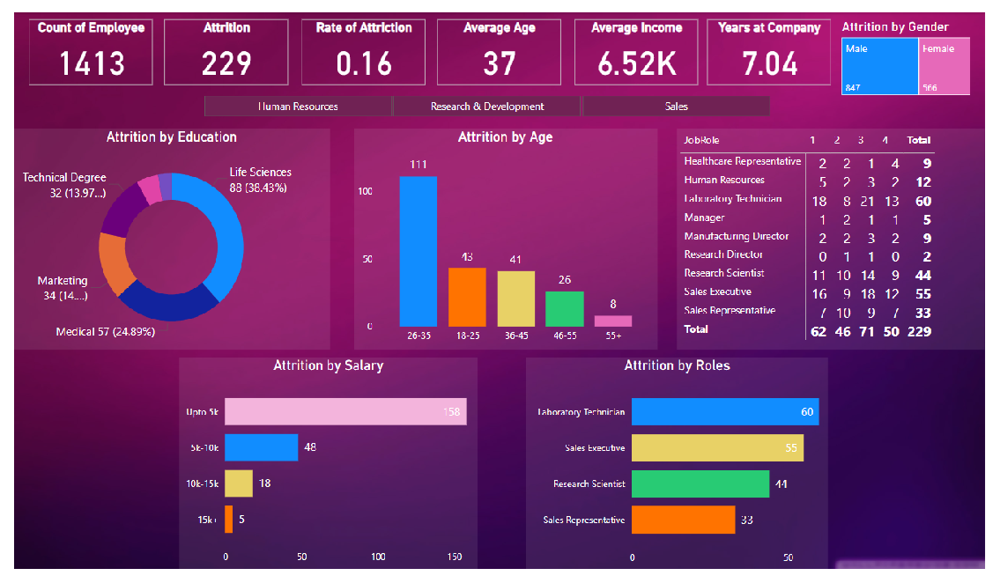

# Company-Attrition - Employee Attrition Dashboard 

This personal project showcases my ability to transform raw HR data into meaningful, interactive visual insights using Power BI. I developed an Employee Attrition Dashboard to analyze and present employee turnover trends across multiple dimensions such as age, department, salary, and gender.

**Note:** The data used in this project is mock data and was created solely for the purpose of this project

## Screenshot

  

# Objectives
The primary goal of this project was to demonstrate how data can be leveraged to uncover attrition patterns and support strategic decision-making in HR. The dashboard aims to simulate how leadership teams can use visual insights for better workforce management.

# Key Features & Insights
- Attrition Overview
A clean and intuitive summary view of overall attrition trends with KPI indicators and line charts for quick understanding.
- Age Group Analysis
Attrition data segmented by age groups. Interactive charts highlight patterns and help identify age brackets with higher turnover.
- Departmental Insights
Department-wise attrition visualized using stacked bar charts and heat maps to pinpoint organizational areas with higher attrition.
- Salary Group Impact
Explored the link between compensation and attrition rates using scatter plots and bubble charts to uncover patterns.
- Gender-wise Attrition
Gender-based attrition breakdown with pie charts and histograms, helping visualize disparities or trends across genders.
- Interactive Exploration
The dashboard includes filters, slicers, and drill-down features, allowing users to explore data dynamically based on different categories.
- Mobile Responsiveness
Designed to be fully responsive across devices, ensuring a smooth experience on both desktop and mobile platforms.

# Outcomes
This project illustrates how data storytelling and visualization can simplify complex HR challenges. By presenting mock attrition data in a clear and insightful format, the dashboard simulates how decision-makers can:
- Detect high-risk attrition segments
- Understand contributing factors
- Implement targeted retention strategies

# Tools & Technologies
- Power BI
- DAX
- Data Modeling
- Mock HR Dataset

# Conclusion
This project serves as a demonstration of my skills in data analysis, visual storytelling, and dashboard development. It reflects how impactful and user-centric dashboards can empower better decision-making in real-world business scenarios—especially in human resource management.